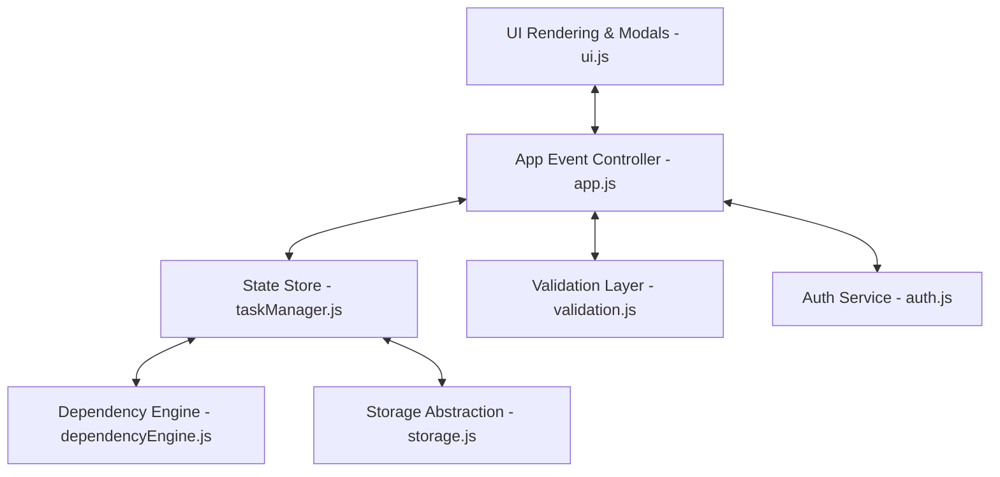

# FlowLock

> Dependencies decide what moves next.

FlowLock is a real-time, dependency-aware project management workspace that prevents engineering teams from starting blocked work. Traditional Kanban boards allow tasks to be dragged into active states regardless of whether prerequisite work is complete. FlowLock enforces an algorithmic graph validation engine to block status movement until all dependencies reach **Done**.

---

## Overview

Modern software teams suffer from premature task execution — developers pick up frontend integration tasks before backend APIs exist, or deploy services before integration tests pass. FlowLock introduces directed graph dependency enforcement natively into the Kanban workflow, ensuring tasks remain locked until all prerequisite dependencies are satisfied.

---

## The Problem

Standard task management platforms (Trello, Jira) treat tasks as independent cards:
- Tasks can be moved to **In Progress** or **Done** regardless of incomplete prerequisites.
- No dynamic lock calculation or anti-cheat protection.
- Dependency chains are purely informational, leading to broken sprints and unblocked invalid work.

---

## The Solution

FlowLock integrates a **Directed Dependency Graph Engine**:
- **Automated Locking**: Tasks retain explicit dependency references (`dependsOn: []`). A task is algorithmically **LOCKED** until every dependency reaches **Done**.
- **Anti-Cheat Enforcement**: Dragging a locked task into *In Progress* or *Done* is intercepted and rejected with interactive dependency feedback.
- **Topological Lock Propagation**: When a prerequisite task is completed, lock states propagate downstream, automatically unlocking ready tasks.
- **Graph Cycle Detection**: Prevents circular dependencies (`A → B → C → A`) before saving graph state.

---

## Key Features

- 🔒 **Algorithmic Lock Engine**: Dynamic lock calculation across task trees.
- 🔄 **DFS Cycle Detection**: Graph cycle prevention using Depth-First Search traversal.
- ⚡ **Anti-Cheat Status Protection**: Native browser drag-and-drop movement rejection with card shake feedback.
- 🌊 **Cascading Lock Propagation**: Live lock recalculation on task status transitions.
- 📊 **Real-Time Workspace Metrics**: Dynamic statistics for Unblocked Health %, Total, Todo, In Progress, Done, and Locked Tasks.
- 🔍 **Dependency Inspector**: Interactive visual node representation of completed (🟢), pending (🟡), blocking (🔴), and current (🔵) dependency steps.
- 📥 **JSON Workspace Persistence**: Board export and schema-validated JSON import.
- 🌙 **Dark / Light SaaS UI**: Modern design tokens, responsive layout, glassmorphism card styling.

---

## Dependency Engine

The dependency engine treats the task collection as a directed graph $G = (V, E)$, where $V$ represents tasks and $E$ represents directed dependency edges $u \rightarrow v$ ($u$ depends on $v$).

### Topological Lock Calculation
A task $T$ is evaluated as locked if:

$$\text{Locked}(T) = \exists \, D \in T.\text{dependsOn} \quad \text{such that} \quad \text{Status}(D) \neq \text{'Done'}$$

```
[ Task A: Database Design (Done) 🟢 ]
                 ↓
[ Task B: Backend API (Done) 🟢 ]
                 ↓
[ Task C: Authentication (In Progress) 🟡 ]
                 ↓
[ Task D: Frontend Integration (LOCKED) 🔒 ]
```

---

## Cycle Detection

Before adding an edge $T_{\text{target}} \rightarrow T_{\text{dependency}}$, FlowLock runs Depth-First Search (DFS) traversal starting from $T_{\text{dependency}}$. If $T_{\text{target}}$ is reachable, a cycle is detected and aborted:

$$\text{Cycle Condition: } \exists \text{ path } P \text{ from } T_{\text{dependency}} \rightarrow T_{\text{target}}$$

The application displays the detected cycle chain: `A → B → C → A`.

---

## Lock / Unlock Propagation

When task $T$ transitions to **Done**:
1. FlowLock updates $T.\text{status} = \text{'Done'}$.
2. The engine identifies all tasks where $T \in \text{dependsOn}$.
3. Downstream tasks recalculate their `locked` status.
4. Tasks whose remaining dependencies are all `Done` automatically transition to **UNLOCKED**.

---

## Architecture

FlowLock is built using a clean, decoupled client-side architecture separating Business Logic, State Management, Storage, Validation, and UI Rendering:



---

## Tech Stack

- **Frontend**: HTML5, Vanilla CSS3 (Custom Design Tokens, Dark/Light Themes)
- **Logic & Graph Algorithms**: Modular Vanilla JavaScript (ES6 Modules)
- **Persistence**: Browser `localStorage` (Tasks, Activity Log, Preferences)
- **Session Auth**: Browser `sessionStorage` (Demo Workspace Auth)

---

## Project Structure

```
kanbanaproject/
├── index.html           # Login screen & SessionStorage auth entry point
├── dashboard.html       # Main FlowLock Workspace & Kanban Board
├── styles.css           # SaaS CSS Design System
├── js/
│   ├── utils.js            # ID generation, date formatters, toast alerts
│   ├── storage.js          # LocalStorage & SessionStorage encapsulation, JSON import/export
│   ├── auth.js             # Session authentication state & route guard
│   ├── dependencyEngine.js # DFS cycle detection, topological locking & lock propagation
│   ├── taskManager.js      # Central state store (CRUD, search, filter, sort, activity log)
│   ├── validation.js       # Form validation logic & status transition rules
│   ├── ui.js               # Render engine (Kanban columns, cards, Dependency Inspector)
│   └── app.js              # Application controller, event listeners, drag & drop handlers
└── README.md            # Product documentation
```

---

## Getting Started

1. Clone or download the repository:
   ```bash
   git clone https://github.com/username/flowlock.git
   cd flowlock
   ```
2. Serve the static directory using any local web server:
   ```bash
   npx serve .
   # or
   python -m http.server 8000
   ```
3. Open `http://localhost:8000/index.html` in your browser.

---

## Usage

### Demo Credentials
- **Email**: `demo@flowlock.app`
- **Password**: `flowlock123`

### Key Interactions
- **Drag and Drop**: Drag tasks across columns. Dragging a locked task to *In Progress* triggers anti-cheat protection.
- **Inspect Graph**: Click **"Inspect Graph"** on any task card to open the visual dependency inspector.
- **Quick Actions**: Use the header controls to simulate blocked moves, complete prerequisite tasks, or reset the workspace.

---

## Screenshots

*(Include screenshots of Dashboard, Dependency Inspector Modal, Dark Mode, and Anti-Cheat Lock Notification)*

---

## Testing

FlowLock includes a built-in automated test suite covering:
1. **Cycle Detection**: Validates DFS recursion path detection (`A → B → C → A`).
2. **Lock Calculation**: Validates single, multi-level, and branching dependency locks.
3. **Lock Propagation**: Validates cascading un-locking down dependent chains.
4. **Anti-Cheat Validation**: Validates rejection of illegal status moves.

---

## Technical Decisions

- **Zero External Dependencies**: Implemented native HTML5 Drag and Drop and custom DFS graph algorithms without third-party frameworks to maintain maximum performance and zero package overhead.
- **Modular ES Architecture**: Decoupled state management from DOM rendering so the dependency engine can be extracted into an Express REST API backend or React frontend in future iterations.

---

## Why FlowLock?

FlowLock turns passive task lists into active, dependency-aware workflows. By enforcing task prerequisites algorithmically, engineering teams save time, eliminate blocked sprints, and ensure software deliverables are built in logical order.
