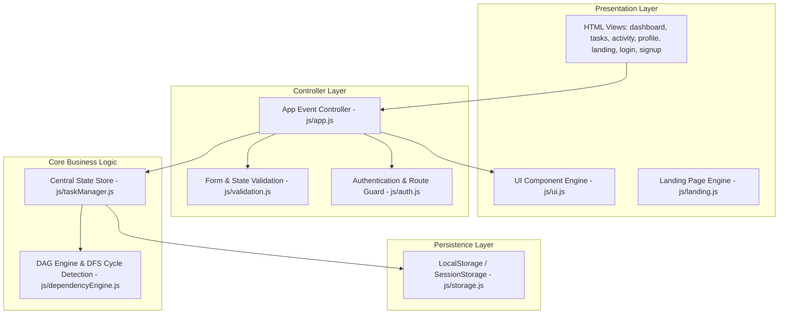

# FlowLock — Architecture & Code Smells Review

This document provides an in-depth architectural evaluation of **FlowLock**, examining its design patterns, state management, graph traversal algorithms, code duplication, and maintainability bottlenecks.

---

## 1. System Architecture Overview

FlowLock follows a decoupled client-side modular architecture:

---

## 2. Core Algorithmic Evaluation (`dependencyEngine.js`)

### 2.1 Graph Formulation
- FlowLock models tasks as vertices $V$ and dependencies as directed edges $E$.
- The directed edge $u \rightarrow v$ indicates that task $u$ **depends on** task $v$ ($v$ is a prerequisite for $u$).
- A task is evaluated as **LOCKED** if $\exists \, v \in u.\text{dependsOn} \text{ such that } \text{Status}(v) \neq \text{'Done'}$.

### 2.2 Algorithmic Strengths
1. **Linear Recalculation ($O(V + E)$):** `recalculateLocks` maps over tasks and performs constant-time map lookups per dependency ID. For standard workspaces ($V < 1000$), recalculation takes less than 1ms.
2. **Topological Invalidation:** Moving a task to `Done` triggers `propagateDependencyState`, identifying direct downstream dependents and updating their locked state in a single pass.
3. **Anti-Cheat Validation:** Status transitions to `In Progress` and `Done` are validated prior to state mutation, rejecting illegal moves.

### 2.3 Algorithmic Improvements Implemented
1. **Recursion-Stack DFS Traversal:** Evaluates proposed dependency arrays against a simulated graph clone, avoiding false positive cycles during task edits.
2. **Orphan Dependency Handling:** Missing or deleted dependency IDs no longer create permanent un-unlockable task states.

---

## 3. State Management & Data Flow

### 3.1 Single In-Memory Singleton vs Multi-Page Independence
- `taskManager` is exported as a singleton instance (`export const taskManager = new TaskManager();`).
- In a multi-page HTML application (MPA), navigating from `dashboard.html` to `tasks.html` destroys the JS execution context and creates a **new** instance of `TaskManager`, re-reading from `localStorage`.

---

## 4. DRY (Don't Repeat Yourself) Violations

### 4.1 Duplicated Task Modal Markup
The identical 72-line Task Modal HTML markup exists in both:
- [`dashboard.html:L218-L290`](file:///c:/Users/legha/OneDrive/Desktop/FinalEVAL1/FlowLock/dashboard.html#L218-L290)
- [`tasks.html:L128-L200`](file:///c:/Users/legha/OneDrive/Desktop/FinalEVAL1/FlowLock/tasks.html#L128-L200)

### 4.2 Duplicated Theme Toggle Logic
The theme toggle logic is repeated across HTML views.

---

## 5. CSS Architecture & Bloat Analysis

[`styles.css`](file:///c:/Users/legha/OneDrive/Desktop/FinalEVAL1/FlowLock/styles.css) has grown to **2,946 lines (~58 KB)**.

### Key Observations:
1. **Redundant Form & Auth Styles:** Multiple overlapping auth class declarations.
2. **Conflicting Specificity:** Over-reliance on `!important` flags in form validation classes.
3. **Unused / Duplicate Utility Classes:** Multiple `.badge` and `.card` style variations.
